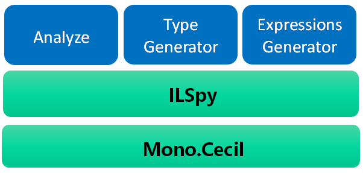
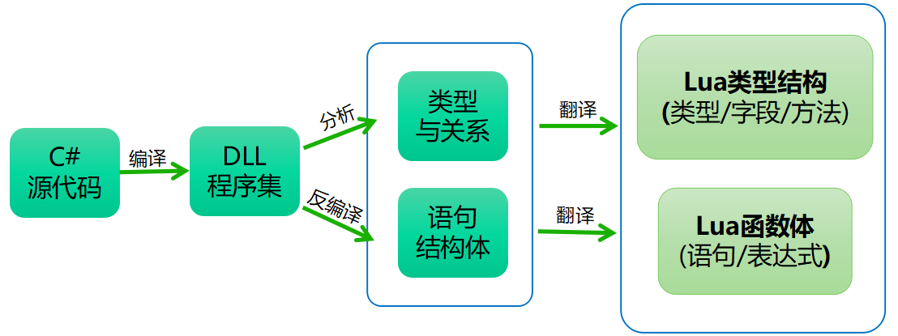
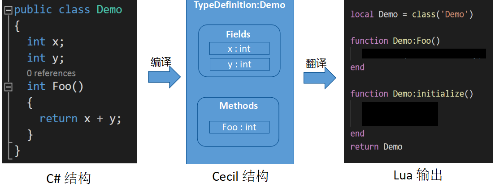
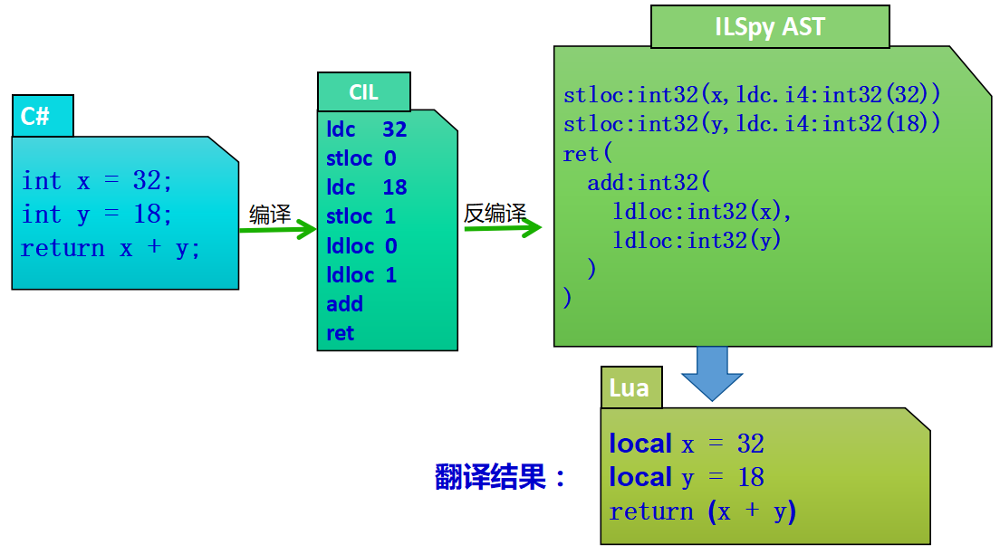
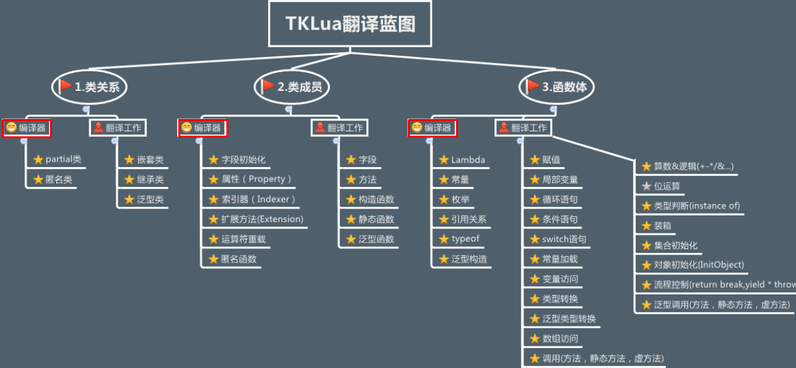
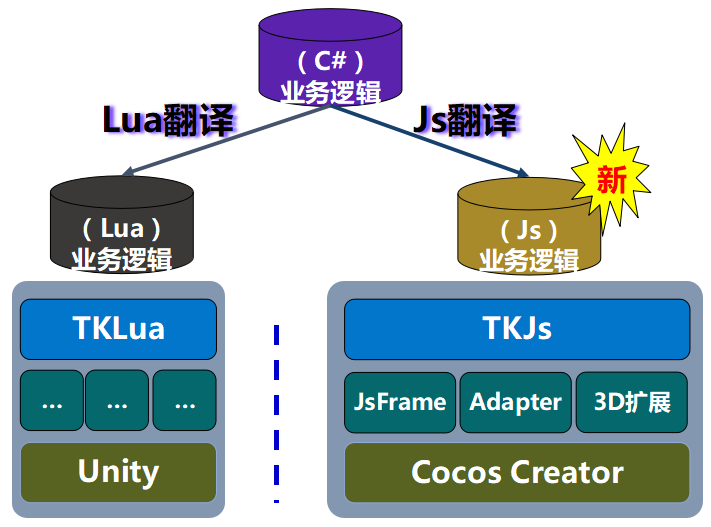

# Lua翻译工具-C#转Lua

腾讯互娱光子工作室群 专家工程师 罗春华

腾讯互娱光子工作室群 高级工程师 陈玉钢

## 摘要 {-}

本文介绍一种C#代码转Lua代码的翻译方案，简称TKLua翻译方案。使用TKLua翻译方案，在项目开发时可以使用C#语言进行开发，但在项目发布时会将C#代码翻译成Lua代码。开发时兼顾C#的开发效率，发布后又享受Lua动态语言的便利，适用于有代码热更新诉求的Unity手机游戏。

TKLua翻译方案具有一定独特性，与传统翻译方案不同，TKLua翻译方案采用了翻译程序集而并非翻译源代码的形式。该方案利用标准C#编译器的编译结果完成了高级语言特性的分析，大幅降低了翻译难度，其翻译原理是：

1. 利用Mono Cecil @Mono_Cecil 库分析程序集中的类、字段、方法签名，然后将其翻译成对应的Lua所模拟的类型结构。
2. 通过ILSpy @ILSpy 工具分析IL指令集，重建由语句表达式组成的抽象结构树，并翻译成对应的Lua方法体。
3. 把Lua类型结构与Lua方法体合并成完整的Lua代码。

同样原理，还可以把C#代码翻译成其它语言，例如JavaScript，以快速移植到微信小游戏等平台，从而实现同一份代码翻译到多个语言平台，避免了重复开发工作。

## 设计初衷

手机网络游戏客户端对代码热更新有很强的诉求，采用Lua开发是实现代码热更新的常用方案。

如果项目规模比较大，往往需要开发团队熟练掌握Lua、设计非常合理的编码规范，才能输出高质量的Lua代码。而由于Lua是弱类型语言，运行前难以静态分析(这也是TypeScript @TypeScript 解决的核心问题)这导致下列影响开发效率的问题:

* 绝大部分情况下IDE难以提供成员自动补全提示，这不是IDE设计的问题，而是弱类型语言特性决定的。
* Lua编译期所能检查的错误非常有限，许多问题要运行时才能暴露出来。
* 没有测试用例覆盖的情况下项目难以重构，而对于游戏客户端来说，测试用例覆盖成本相对比较高。


本文介绍的TKLua翻译，是一种极低成本的翻译方案，它的设计初衷是让开发过程对Lua无感知，开发时使用C#开发，运行和发布时，一键把C#代码翻译成Lua。程序员既能享受C#的强类型、类型推导、类型检查带来的便利性，又能享受翻译后Lua动态语言热更新的优点。

## 实现原理

### 参考对比行业其它类似解决方案

行业内已经有一些解决类似问题的成熟方案：

* Haxe @Haxe ：一种新的编程语言，其配套的编译器可以将Haxe语言编译成其他通用语言，比如js,as,php,c++等等。

* Bridge.NET @Bridge_NET ：这是一个商业化的开源项目，它能够把C#语言翻译成JavaScript。

* TypeScript @TypeScript ：微软出品，是JavaScript的一个严格超集。添加了静态类型和基于类的面向对象编程，语言风格非常像C#。设计目标是开发大型应用，然后转译成JavaScript。

以上解决方案，都是从源码开始，经过词法分析、语法分析等常规的编译过程，综合的工程复杂度较高。

而TKLua选择的方案是从标准编译后的程序集Assembly @Assembly_CLI (本文统称程序集)开始，相比源码，程序集的结构要简单非常多。借助程序集分析工具可以很方便的提取和处理程序结构和指令信息，进而转换输出成逻辑表达和原程序集一致的lua。

### 翻译原理

本节介绍TKLua翻译原理，TKLua翻译方案采用了翻译程序集的形式，而并非直接翻译源代码。该方案利用标准编译器的编译完成了高级语言特性的分析，大幅降低了翻译难度。

翻译器主要原理是利用两个成熟的开源库:Mono.Cecil和ILSpy。其中Mono.Cecil负责从程序集中提取类、字段、方法。ILSpy则负责分析方法体指令序列。

结构上如图\ref{fig:TKLua}所示，底层两个开源库Mono.Cecil和ILSpy(ILSpy基于Mono.Cecil)，翻译器分整体分析器(Analyze),类型生成(Type Generator)和表达式生成器组成(Expressions Generator)。

* Analyze：分析程序集参数和多程序集关系。
* Type Generator：分析程序集中的类、字段、方法生成对应的Lua结构。
* Expressions Generator: 分析函数体，利用ILSpy重建的Ast，生成对应的Lua表达式。



### 翻译流程

​本节详细介绍翻译流程。在C#源代码经过编译得到程序集之后，流程上经过三步对程序集进行分析和生成：

1. 类型结构翻译，通过Mono Cecil分析程序集中的包含的所有类，以及类中定义的字段和方法定义，收集到这些信息，于是可以生成Lua的对应的类型和结构及方法定义。注意的是，此时所得到的方法定义只包含方法签名，无法得到方法体。
2. 方法体翻译，利用ILSpy将方法体里面的IL指令序列重建成抽象语法数(AST)结构，翻译工具将AST转换成Lua语句和表达式，形成Lua方法体。
3. 把第一步输出的Lua类型结构与第二步输出的Lua方法体，合成完整的Lua文件，从而实现了C#到Lua的翻译过程。



#### 类型结构翻译

​本节详细介绍第一步类型结构翻译，如图\ref{fig:translatestruct}所示：

1. 图最左边是C#源代码，定义了一个类Demo，包含x，y两个成员变量，以及一个成员函数Foo；
2. 源代码经过编译之后，通过Mono Cecil分析程序集得到图中间的Cecil结构，结构内包含了Demo类型、x，y字段和方法Foo定义；
3. 通过对Cecil结构的翻译，生成图最右边的Lua的Demo类型和Foo方法定义的输出，值得注意的是，此刻方法还只是方法签名，没有方法体。由于Lua是弱类型，x，y字段亦可无需定义。



​类型结构翻译，是通过Mono Cecil分析程序集中的包含的所有类，以及类中定义的字段和方法定义，生成Lua的对应的类型和结构及方法定义。

**方法体翻译**

​本节详细介绍第二步方法体翻译，如图\ref{fig:translatesample}所示：

​1. 图最左边是C#源代码，定义了`int x=32; int y=18; return x+y;`三条语句；
2. 源代码经过编译之后，形成图中部的IL指令集，IL是基于栈的指令，图中含义是把值32存储在0号栈空间，值18存储在1号栈空间，然后执行add指令，并返回运算结果；
3. 通过ILSpy分析上述IL指令流，生成ILSpy对应的抽象结构树AST；
4. 最后分析抽象结构树AST，并查找对应的符号表，最后翻译生成Lua对应的语句`local x=32; local y=18; return x+y`。



​语句翻译过程，是通过ILSpy分析程序集中IL指令集，分析语句和表达式，生成Lua的语句和表达式，形成方法体。

​最后把Lua类型结构和Lua方法体，合成完整的Lua文件，从而实现了C#到Lua的翻译过程。

## 翻译示例

​本节详细介绍TKLua翻译示例。

​翻译示例C#代码如下：
```c#
public class ChatPanelPao : ModelViewBehaviour
{
    [Bind("seat_me")]
    public ExternalPrefab seat_me;
    [Bind("seat_right")]
    public ExternalPrefab seat_right;
    [Bind("seat_opposite")]
    public ExternalPrefab seat_opposite;
    [Bind("seat_left")]
    public ExternalPrefab seat_left;
    
    Dictionary<int, ExternalPrefab> seats = 
    	new Dictionary<int, ExternalPrefab>();
    Dictionary<int, ChatItemPao> seatItems = 
    	new Dictionary<int, ChatItemPao>();

    protected override void Awake()
    {
        base.Awake();
        aliveBinder.binding<ChatModel, ChatModel.MixMsgItem>(doAppendItem);
        //初始化椅子关系
        seats.Add(LayoutUtil.SEAT_POSITION_Me, seat_me);
        seats.Add(LayoutUtil.SEAT_POSITION_Right, seat_right);
        seats.Add(LayoutUtil.SEAT_POSITION_Opposite, seat_opposite);
        seats.Add(LayoutUtil.SEAT_POSITION_Left, seat_left);
    }
    protected override void Start()
    {
        base.Start();
        foreach (var pos in seats.Keys)
        {
            var externPrefab = seats.get(pos);
            var instance = LuaBehaviour.
            	getLuaBehaviour<ChatItemPao>(externPrefab.instance);
            seatItems.Add(pos, instance);
            //使用连接器的锚点，传递箭头的对其
            var externPrefabRect = (RectTransform)externPrefab.transform;
            instance.setPaoPivot(externPrefabRect.pivot.x);
         //   instance.rectTransform.sizeDelta = externPrefabRect.sizeDelta;
        }
    }
    
    void doAppendItem(ChatModel.MixMsgItem msg)
    {
        var chatItem = seatItems.get(msg.sender.localChairId);
        if(chatItem!=null)
        {
            chatItem.setMsgModel(msg);
        }
    }
}
```
------

​翻译示例生成的Lua代码如下：

```lua
-------------
---缓存类型和静态绑定的变量
local T_ExternalPrefab = TKNS.TKFrame.ExternalPrefab
local T_CSLDictionary = CSLDictionary
local T_KeyCollection = CSLDictionary.KeyCollection
local T_RectTransform = TKNS.UnityEngine.RectTransform
local F_Add = T_CSLDictionary.Add
local F_GetEnumerator = T_KeyCollection.GetEnumerator
local F_Keys = T_CSLDictionary.get_Keys
-------------
---本类型里被引用函数的声明
local doAppendItem
-------------
--------
---code begin
---------------------
---------------------
local ChatPanelPao = class('ChatPanelPao',CSLTypes.ModelViewBehaviour)

def_bind(ChatPanelPao,{
	{'seat_me',typeof(T_ExternalPrefab),name='seat_me'},
	{'seat_right',typeof(T_ExternalPrefab),name='seat_right'},
	{'seat_opposite',typeof(T_ExternalPrefab),name='seat_opposite'},
	{'seat_left',typeof(T_ExternalPrefab),name='seat_left'},
})

--
--ILMethod:System.Void ChatPanelPao::Awake()
function ChatPanelPao:Awake()
	CSLTypes.ModelViewBehaviour.Awake(self)
	CSLTypes.ModelViewBehaviour.get_aliveBinder(self)
            :binding(CSLTypes.ChatModel , 
                CSLTypes.ChatModel.MixMsgItem,
                CSLNewfunc(self , doAppendItem) , 
                nil  ,  nil  ,  nil  ,  nil )
	--初始化椅子关系
	F_Add(self.seats , 
        CSLTypes.LayoutUtil.SEAT_POSITION_Me , self.seat_me)
	F_Add(self.seats , 
        CSLTypes.LayoutUtil.SEAT_POSITION_Right , self.seat_right)
	F_Add(self.seats , 
        CSLTypes.LayoutUtil.SEAT_POSITION_Opposite , self.seat_opposite)
	F_Add(self.seats , 
        CSLTypes.LayoutUtil.SEAT_POSITION_Left , self.seat_left)
end

--
--ILMethod:System.Void ChatPanelPao::Start()
function ChatPanelPao:Start()
	CSLTypes.ModelViewBehaviour.Start(self)
	local var_0 = F_GetEnumerator(F_Keys(self.seats))
	local pos
	local externPrefab
	local instance
	local externPrefabRect
	for _,pos in CSLEach(var_0) do
		externPrefab = CSLDictionary.get(self.seats , pos)
		instance = CSLTypes.LuaBehaviour.
        	getLuaBehaviour(externPrefab.instance)
		F_Add(self.seatItems , pos , instance)
		--使用连接器的锚点，传递箭头的对其
		externPrefabRect =  CSLStaticCast(
            T_RectTransform,externPrefab.transform)
		instance:setPaoPivot(externPrefabRect.pivot.x)
	end
end

--
--ILMethod:System.Void 
--ChatPanelPao::doAppendItem(ChatModel/MixMsgItem)
function ChatPanelPao:doAppendItem(msg)
	local chatItem = CSLDictionary.get(self.seatItems, 
        msg.sender.localChairId)
	if chatItem then
		chatItem:setMsgModel(msg)
	end
end

--
--ILMethod:System.Void ChatPanelPao::.ctor()
function ChatPanelPao:initialize()
	self.seat_me = nil
	self.seat_right = nil
	self.seat_opposite = nil
	self.seat_left = nil
	self.seats = nil
	self.seatItems = nil
	self.seats = CSLNew(T_CSLDictionary)
	self.seatItems = CSLNew(T_CSLDictionary)
	CSLTypes.ModelViewBehaviour.initialize(self)
end
-------------
---本类型里被引用函数的赋值
doAppendItem = ChatPanelPao.doAppendItem
-------------
return ChatPanelPao
```
C#源代码经过上述翻译过程之后得到Lua源代码。可以看到，两份代码能找到以下一一对应关系：

- C#中调用基类函数`base.Awake()`，翻译之后变成Lua中`Awake(self)`。
- 泛型函数`binding<...>()`，翻译之后泛型参数变成方法参数`binding(...)`。
- 非虚函数seats.Add，翻译之后变成Upvalue缓存函数F_Add。
- C#迭代器，翻译之后对应Lua迭代器。
- C#风格注释，翻译之后对应Lua风格注释。

​注意：由于在Lua中类成员访问是通过table(字典部分)来模拟的，其实就是一张hash表，每次访问都是一次Hash查找，而不是像编译型语言一样在编译期就能确定成员函数和变量地址(虚函数除外)，所以lua的成员访问有一定的额外消耗，一般有优化经验的人在编写Lua代码时会将不变化的函数缓存到upvalue。所以此处F_Add调用的生成就是翻译器优化的结果。虚函数Awake和Start则无法进行这种缓存优化。

## 实现细节

​本节详细介绍翻译过程中一些典型细节及优化方法，例如Lua不支持连续赋值的问题、Lua不支持switch、Lua不支持continue等问题的解决方案。

**连续赋值**

​在Lua中赋值是没有返回值，故无法对变量进行连续赋值，TKLua采用的方案是拆解表达式，如图\ref{fig:problem}，把`y=x=foo()拆解成两次独立赋值，利用临时变量csl_0作为中间存储：csl_0=foo(); x=csl_0; y=csl_0;`


​*注：也能设计成采用闭包来模拟实现连续赋值，比如:
y=(function() x = foo(); return x end)()
但是运行性能将会变差很多。

**switch**

由于在Lua中，没有switch语句，所以翻译过程中，需要用其它语句来模拟。TKLua翻译采用的是用if条件判定和repeat循环来模拟switch：

* switch中`case`判定，用`if...else...`模拟判定。
* switch中`break`跳转，用`repeat...break`模拟跳转。

翻译效果如下所示：

C#下的switch代码如下所示：
```cs
switch(v)
{
    case 1:
        <逻辑代码>
        break;
    case 2:
        <逻辑代码>
        break;
    default:
        <逻辑代码>
        break;
}
```
---
翻译后Lua下的switch代码如下所示：

```lua
repeat
    if v==1 then 
        --case 1:
        --[逻辑代码]
        break;
    end
    --case 2:
    --[逻辑代码]
    break;
    end
--default:
--[逻辑代码]
until true
```

​注意，在Lua中if条件判定和repeat循环分别只需要一条指令，故性能不受影响。如果采用table表来模拟switch的功能，需要特别注意表的创建和销毁开销，避免运行性能变差。

**continue**

由于在Lua中，没有`continue`语句，所以翻译过程中，需要用其它语句来模拟。在一个循环块中可能同时存在任意数量的`continue`和`break`，如下图，TKLua翻译采用的是用内嵌`repeat`循环和`break`模拟：

* 增加内嵌`repeat`循环层。

* 原C#中一个`continue`，翻译成Lua中一个`break`，仅跳出内层循环。

* 原C#中一个`break`，翻译成Lua中两个`break`，跳出两层循环。

C#的while continue如下所示：

```c#
while
{
    ...continue;
	...break;
}
```
---
lua的 while continue如下所示：

```lua
while true do
    repeat
        ...break
        ...break
    until true
    ...break
end
```

**不定参数**
C#的不定参数在编译后是数组参数传值，源码中的不定参数的信息会被编译器丢弃。翻译输出时将其当做数组参数传值输出。*虽然非常便利，但是难以还原成更为高效的Lua不定参数传值*。

c# 多参数代码如下所示：
```c#
public class TestParams
{
    public static void Foo(params string[] args)
    {
        //...
    }
    public static void Test()
    {
        //翻译后是数组传值
        Foo("arg1", "arg2", "arg3");
    }
}
```
---
lua 多参数代码如下所示：
```lua
local Foo
local TestParams = class('TestParams')

function TestParams.Foo(args)
end

function TestParams.Test()
    --翻译后是数组传值
    Foo(CSLInitArray('arg1' , 'arg2' , 'arg3'))
end

Foo = TestParams.Foo

return TestParams
```

**性能优化：** 因为源代码在进行编译之后，将会对字符串、常量、枚举、计算等进行一系列优化，比如删除无效无用代码，预处理各种字符串，减少运行时开销等，这种优化也对最终Lua代码的生成产生优化效果。可以理解为，TKLua的翻译代码是经过编译优化之后的代码，对性能效率的提升非常有帮助。

**安全性：** 如果需要提高代码安全性，可以对程序集进行代码混淆，从而翻译后Lua代码也是混淆的，快速提高了代码安全性。

如下面的代码所示，在对程序集混淆后，自动输出混淆后的Lua代码：

混淆示例C#代码如下所示：

```c#
public void updateFrom(CommonModel other)
{
    var myDatas = _datas;
    var otDatas = other._datas;
    
    foreach(var key in myDatas.Keys)
    {
        var myData = myDatas.get(key);
        var otData = otDatas.get(key);
        myData.updateFrom(otData);
    }
}
```
---
混淆后的Lua如下所示：
```lua
--ILMethod:System.Void CommonModel::updateFrom(CommonModel)
function CommonModel:updateFrom(other)
    local var_0 = self.a
    local var_1 = other.a
    local var_2 = var_0:get_Keys():GetEnumerator()
    local var_3
    local var_4
    local var_5
    for ,var_3 in CSLEach(var_2) do
        var_4 = var_0:get(var_3)
        var_5 = var_1:get(var_3)
        var_4:updateFrom(var_5)
   	end
end
```

### TKLua翻译蓝图

​本节介绍的TKLua已经实现的翻译蓝图，是为了保障翻译完备性，列举了C#的各种高级特性。翻译蓝图一共分为三大部分内容：

**类关系**

* partial类：编译后，自动合并完整的具体类，由标准编译器完成工作。
* 匿名类：编译后，生成具体实名类，由标准编译器完成工作。
* 嵌套类：生成Lua形式的嵌套关系，由翻译工具完成工作。
* 继承类：生成继承关系的类型，由翻译工具完成工作。
* 泛型类：部分实现，后续可补充实现。

**类成员**

* 字段初始化：编译后，在初始化函数中生成赋值过程，由标准编译器完成工作。
* 属性：编译后，添加set/get具体函数，由标准编译器完成工作。
* 索引器：编译后，索引对应的函数过程，由标准编译器完成工作。
* 扩展方法：编译后，为类扩展的方法变成静态函数调用，由标准编译器完成工作。
* 运算符重载：编译后，运算符重载变成具体函数调用，由标准编译器完成工作。
* 匿名函数：编译后，匿名函数自动变成实名函数，由标准编译器完成工作。
* 字段：弱类型语言字段，无需特别定义，由翻译工具完成工作。
* 方法：生成对应的常规Lua方法，由翻译工具完成工作。
* 构造函数：生成对应的Lua初始化函数，由翻译工具完成工作。
* 静态方法：生成对应的Lua对应的全局函数，由翻译工具完成工作。
* 泛型函数：泛型参数变成函数参数，生成对应Lua函数，由翻译工具完成工作。
* 匿名构造函数和类成员初始化：标准编译器将自动合并到构造函数里，翻译工具输出。
* 匿名静态构造函数和静态成员初始化：标准编译器将自动生成语句，翻译工具输出。
* 可选参数：编译后，未填写的参数将自动使用默认值填充，由标准编译器完成工作。
* 多参数：编译后等价于数组参数，由标准编译器完成工作。

**函数体**

* Lambda表达式：编译后，表达式展开为具体函数调用，由标准编译器完成工作。
* 常量：编译后，常量名被替换为具体常量值，由标准编译器完成工作。
* 枚举：编译后，枚举值被替换为整形，由标准编译器完成工作。
* 引用关系：编译后，引用关系变成类型之间相互调用，由标准编译器完成工作。
* Typeof：编译后，替换成具体类型，由标准编译器完成工作。
* 泛型构造：编译后，泛型参数被实例化，由标准编译器完成工作。
* 赋值：生成Lua赋值，连续赋值将被拆解，由翻译工具完成工作。
* 局部变量：生成Lua的局部变量local，由翻译工具完成工作。
* 循环语句：反编译后所有的循环都变成单一的Loop结构，翻译工具生成Lua的for循环。
* 条件语句：生成Lua的if条件，由翻译工具完成工作。
* switch语句：由if条件判定和repeat循环组合模拟，由翻译工具完成工作。
* 集合初始化(Collection initializer)：标准编译器生成结构化指令，由翻译工具完成工作。
* 对象初始化(Object initializer)：标准编译器生成结构化指令，由翻译工具完成工作。
* Try...catch语句：生成Lua的xpcall，由翻译工具完成工作。
* 问号表达式:生成等价的 ”或与表达式”。
* 其他：基本直接翻译，由翻译工具完成工作。


注意：图\ref{fig:translatebluemap}红框列举高级特性的翻译，由标准编译器编译完成，大幅降低了翻译复杂度。


## 发展方向

​随着微信小游戏的兴起，越来越多的游戏团队开始关注h5游戏的开发，如果游戏团队想把原有的游戏移植到h5游戏平台，面临着游戏功能需要用Js重写一遍，工程量比较浩大。从原有C#工程简单重构后进行翻译或许可以大幅降低重复开发成本。

上述章节详尽介绍了如何把C#代码翻译成Lua代码，那么利用相同的原理，也能把C#代码翻译成Js代码。



​基于这样的思路方案，TKLua翻译工具增加实现了从C#转Js的翻译功能，为游戏快速移植到微信小游戏平台提供了一种便捷方案。


C#代码如下所示：

```c#
public class CircleMoveTest : cc.Component
{
    public float r = 1;
    public float speed = 1;
    private float time = 0;
    private float startX = 0;
    private float startY = 0;
    protected override void start()
    {
        startX = node.getPositionX();
        startY = node.getPositionY();
    }
    protected override void update(float dt)
    {
        time += dt;
        var x = (float)Math.Sin(time * speed) * r;
        var y = (float)Math.Cos(time * speed) * r;
        this.node.setPosition(startX + x, startY + y);
    }
}
```
---
翻译器生成的Js代码如下所示：
```js
var csl = require('CSLLibs')
	csl.defc('','CircleMoveTest',function(_csl_th){
	var Sin,Cos,CircleMoveTest
	return{
	start:function(){
		var self = this
		self.startX = self.node.getPositionX()
		self.startY = self.node.getPositionY()
	},
	update:function(dt){
		var self = this
		self.time = (self.time + dt)
		var x = (Sin.call((self.time * self.speed)) * self.r)
		var y = (Cos.call((self.time * self.speed)) * self.r)
		self.node.setPosition((self.startX + x) , (self.startY + y))
	},
	_csl_ctor:function(){
		this.time = 0.0
		this.startX = 0.0
		this.startY = 0.0
		var self = this
		
	},
	statics:{
	},
	
	_csl_init_t:function(_){
		CircleMoveTest = _
	},
	_csl_ref:function(){
		Sin=csl.refm('Sin','CSLMath');
		Cos=csl.refm('Cos','CSLMath');
		return {
            superHandler:csl.refmn('cc' , '' , 'Component'),
            properties:
            {
                r:1,
                speed:1,
			}
		}
	},
	}
}
)
```

如果各游戏已经有Unity C#版本，通过上述的翻译过程或许可以快速输出H5版本,以便高效移植微信小游戏、手Q玩一玩、Facebook Instant Games。

## 小结

​TKLua翻译原理是针对程序集进行翻译，而不是针对源代码翻译。而程序集是经过编译器编译以及充分优化的，许多语法糖在编译期就会被整合成常规结构，所以大幅降低了翻译难度，这就是TKLua翻译模式在行业中的优势所在。

在另外一方面来说，从程序集开始的翻译器会丢失一些源码层信息。虽然程序集逻辑表达上是完备的，但是有时候这些信息的丢失会让翻译工具缺少更优的输出选择。比如不定参数和Lambda函数。

##参考
1.https://www.mono-project.com/docs/tools+libraries/libraries/Mono.Cecil/
2.https://github.com/icsharpcode/ILSpy
3.https://www.typescriptlang.org/
4.https://haxe.org/
5.https://bridge.net/
6.https://en.wikipedia.org/wiki/Assembly_(CLI)