# 基于SDF的摇杆移动

腾讯互娱魔方工作室群 高级工程师 郑贵荣

腾讯互娱魔方工作室群 专家工程师 叶劲峰

## 摘要 {-}

当前主流的MOBA手游均采用摇杆移动，为了更好的用户体验，摇杆移动需要解决遇到障碍后绕障碍滑行的问题，在此提供一种基于SDF的摇杆移动解决方案。

SDF（全称 signed distance field）即有号距离场，表示空间中点到形状表面的最短距离，一般用正值表示形状外部，负值表示形状内部。

因为SDF数据生成较为耗时，因此需要预计算生成。顶视角MOBA游戏只需要做二维SDF计算，为减少数据存储量先栅格化地图，通过点到多边形（障碍物）的距离离线计算栅格顶点的有号距离从而生成SDF数据。运行时使用双线性过滤采样可以获得地图任意点的有号距离值，与角色碰撞半径比较判断是否和障碍发生碰撞，检测过程只需查表和插值乘法计算，时间复杂度为$O(1)$。

SDF的梯度方向代表最大的变化方向，因此可以将梯度算子作为边界法线，当角色与障碍发生碰撞后可沿着法线垂直方向滑行，同样可以根据梯度方向快速迭代来处理在MOBA游戏中击飞后“卡”在障碍中的问题。对于瞬间位移（比如闪现）且不能穿越障碍的需求，可采用圆盘投射，以有号距离作为迭代步长。对于AI寻路，SDF也可以通过修改探索函数（判断有号距离与碰撞半径的大小）实现，且可修改碰撞半径搜索贴近或远离障碍物的路径，打破寻路对称性。

前面讲到的SDF是离线预生成的，那么对于MOBA游戏中动态障碍的处理，可使用程序式SDF和CSG运算来实现。不过SDF在提高效率的同时也存在着存储空间大、较难动态更新（地形发生大的变化）的问题。

## 引言

当前MOBA类手游中，移动方式大多采用摇杆移动，摇杆移动首要解决问题是与障碍物的碰撞检测，以及发生碰撞后如何行走（碰撞后直接停止的体验非常糟糕）。根据地图数据的不同，摇杆移动的碰撞检测有多种方法：

1. 物理碰撞的方法：直接使用点（或圆）与多边形进行碰撞检测，然后绕多边形边移动。
2. NavMesh方式：同样需要做点（或圆）与多边形碰撞检测，然后绕多边形边移动。
3. 栅格方式：检测点是否在阻挡栅格内，或者圆与阻挡栅格的距离，碰撞后移动方向不好确定。

这里提供一种更为高效的且更为方便解决其他移动相关需求的方案，基于SDF的摇杆移动。

## 有号距离场SDF

先简要解释下有号距离场的概念，有号距离场（signed distance field，SDF）表示空间中的点到形状表面（比如障碍物）的最短距离（纯量场），一般用距离为负值表示形状内部，正值表示形状外部。

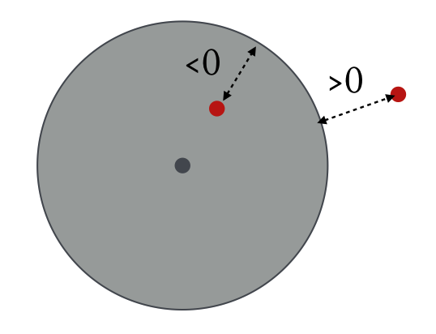{ width=50% }

用数学公式表示，首先定义$\phi:\mathbb{R}^n \to \mathbb{R}$对于一个形状点集$S$
$$
\phi(\mathbf{x})=
\begin{cases}
\phantom{-}\min\limits_{\mathbf{y}\in S}\|\mathbf{x}-\mathbf{y}\| & \text{if }\mathbf{x}\notin S\\
-\min\limits_{\mathbf{y}\notin S}\|\mathbf{x}-\mathbf{y}\| & \text{if }\mathbf{x}\in S\\
\end{cases}
$$
那么检测某点$\mathbf{x}$是否在形状（障碍物）之内表示为：$\phi(\mathbf{x}) \leqslant 0$，如果预先知道每个点的有号距离$\phi(\mathbf{x})$，那么碰撞检测只需要一次查表即可。

## 利用栅格数据预计算SDF

SDF记录的是点到障碍物的距离，核心思想即空间换时间；如果动态计算点$\mathbf{x}$的有号距离$\phi(\mathbf{x})$，那么复杂度跟物理碰撞检测的方案没什么区别。因此我们需要预计算得到整张地图的SDF数据，因为不可能存储地图上所有的点，需要根据障碍精度对地图进行栅格化，比如主流MOBA的5v5地图可以使用$256*256$的栅格。

首先介绍一种基于栅格的SDF预计算方法。

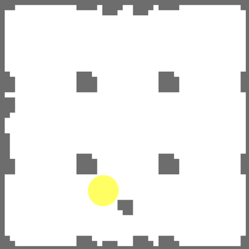{ width=50% }

根据场景障碍生成如图\ref{fig:map}所示的栅格地图，**灰色**表示阻挡，**白色**表示可行走区域。使用Meijster算法 @meijster2002general 计算栅格中任意格子$(x,y)$到障碍栅格区$\mathbf{B}$中最近格子的距离:
$$
\begin{aligned}
d(x, y)&=\sqrt{EDT(x, y)}\\
EDT(x, y)&=\min(i, j:0\leqslant i < m \wedge 0\leqslant j < n \wedge b(i,j):(x-i)^2+(y-j)^2)
\end{aligned}
$$
从而得到一张栅格地图的SDF数据：

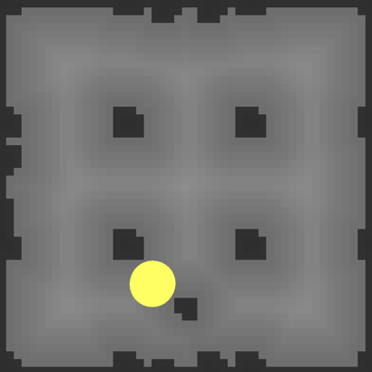{ width=50% }

如果使用2字节表示每个格子的SDF，$256\times256$栅格地图的内存大小为$256 \times 256 \times 2 = 128\text{(KB)}$。在得到栅格地图的SDF后，如何检测角色（如上图黄色圆所表示）与障碍物发生碰撞呢？发生了碰撞后角色又该如何移动呢？

## SDF的碰撞检测与碰撞响应

前面提到$\phi(\mathbf{x}) \leqslant 0$表示点$\mathbf{x}$在障碍物内，那么碰撞检测只需要得到点的$\phi$值，然后与碰撞半径$r$比较即可，$\phi(\mathbf{x}) \leqslant r$表示角色与障碍发生了碰撞。由于栅格地图SDF数据是离散存储的，但角色移动是连续的，不可能把角色在一个栅格内任意位置的$\phi$值等同于栅格顶点，这样会在栅格边界产生巨变，因此无法直接查表获取角色所在位置的$\phi$值，如下图所示圆的圆心位置，需要根据周边栅格顶点的$\phi$值采样获取。

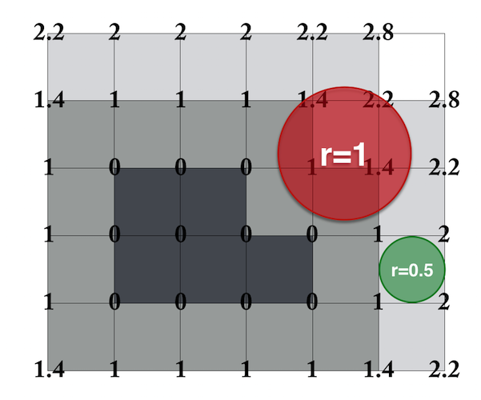{ width=50% }

因为距离本身是线性的，可以采用**双线性过滤（bilinear filtering）**采样角色位置的$\phi$值，根据角色所处栅格的四个顶点线性插值可得到场景任意点的$\phi$值。

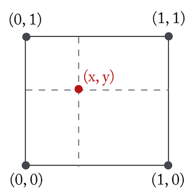{ width=50% }

$$
\phi(x, y)=(1-x)(1-y)\phi(0,0) + x(1-y)\phi(1,0)+(1-x)y\phi(0,1)+xyf(1,1)
$$
由此完成SDF的碰撞检测，只需要查表和乘法计算，时间复杂度为$O(1)$。

~~~cs
//计算位置pos的SD值
//每个栅格的实际尺寸为grid，横向栅格数量为width
public float Sample(Vector2 pos) {
    pos = pos / grid;
    int fx = Mathf.FloorToInt(pos.x);
    int fy = Mathf.FloorToInt(pos.y);
    float rx = pos.x - fx;
    float ry = pos.y - fy;
    int i = fy * width + fx;
    return
        (sdf[i        ] * (1 - rx) + sdf[i         + 1] * rx) * (1 - ry) +
        (sdf[i + width] * (1 - rx) + sdf[i + width + 1] * rx) * ry;
}
~~~

当前几乎所有的MOBA手游在摇杆移动过程中，碰到障碍之后均是绕着障碍滑行，而不是直接停止，因为停止的体验实在很糟糕。那么SDF在发生碰撞后如何处理绕障碍滑行的问题呢？

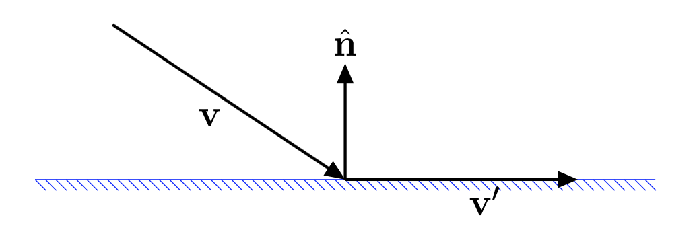{ width=50% }

如上图所示，$\mathbf{v}$表示摇杆方向（角色原始移动方向），当与障碍物发生碰撞后需要沿着$\mathbf{v}^{\prime}$方向滑行，$\mathbf{ v}^{\prime}$和$\mathbf{v}$的关系：
$$
\mathbf{v}^\prime=\mathbf{v}-(\mathbf{v}\cdot\hat{\mathbf{n}})\hat{\mathbf{n}}
$$

上式中$\mathbf{n}$为碰撞法线，如何获取呢？

SDF为纯量场，纯量场中某一点上的梯度（gradient）指向纯量场增长最快的方向，因此可以利用SDF的梯度作为碰撞法线：
$$
\nabla\phi(\mathbf{x})=\begin{bmatrix}\dfrac{\partial\phi}{\partial x}&\dfrac{\partial\phi}{\partial y}\end{bmatrix}
$$

同时$\phi(\mathbf{x})$几乎随处可导，可以使用**有限差分法(finite difference)**求出$\mathbf{x}$处的梯度：
$$
\nabla \phi(x,y)\approx
\begin{bmatrix}
\dfrac{\phi(x +\delta x, y)-\phi(x -\Delta, y)}{2\Delta} &
\dfrac{\phi(x, y +\delta y)-\phi(x -\Delta, y)}{2\Delta}
\end{bmatrix}
$$

从而得到碰撞法线$\mathbf{n}$，求出滑行方向实现碰撞后绕障碍滑行。

~~~cs
//求位置pos的梯度方向
public Vector2 Gradient(Vector2 pos) {
    float delta = 1f;
    return 0.5f * new Vector2(
        Sample(new Vector2(pos.x + delta, pos.y)) - 
        Sample(new Vector2(pos.x - delta, pos.y)),
        Sample(new Vector2(pos.x, pos.y + delta)) -
        Sample(new Vector2(pos.x, pos.y - delta)));
}
~~~

至此得到当角色按摇杆方向移动时的实际移动方向代码：

~~~cs
// 获取移动过程中使用sdf得到最佳位置
public Vector2 GetVaildPositionBySDF(Vector2 pos, Vector2 dir, float speed) {
    Vector2 newPos = pos + dir * speed;
    float SD = Sample(newPos);

    // 不可行走
    if (SD < playerRadius) {
        Vector2 gradient = Gradient(newPos);
        Vector2 adjustDir = dir - gradient * Vector2.Dot(gradient, dir);
        newPos = pos + adjustDir.normalized * speed;

        // 多次迭代
        for (int i = 0; i < 3; i++) {
            SD = Sample(newPos);
            if (SD >= playerRadius) break;
            newPos += Gradient(newPos) * (playerRadius - SD);
        }

        // 避免往返
        if (Vector2.Dot(newPos - pos, dir) < 0)
            newPos = pos;
    }
    return newPos;
}
~~~

##避免往返

虽然SDF能很好的解决绕障碍滑行的问题，但在实际使用中如遇到凹形障碍物，则会出现角色在障碍物内不断往返。

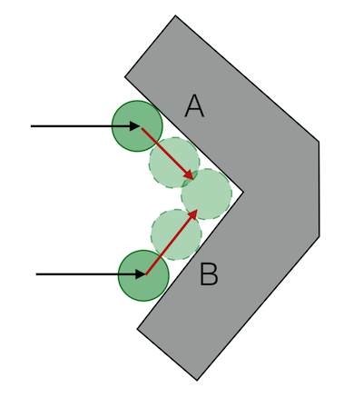{ width=50% }

如上图所示，黑色箭头表示摇杆方向，红色表示角色遇到障碍后绕障碍滑行方向，如果摇杆方向一直保持不变，则角色在A处向右下滑行，到达B处后又会向右上滑行，从而导致角色在凹型槽内AB间不断往返走不出去。那么当前后滑行方向相差大于90度时停止滑动，重新拨动摇杆才能再次移动。

## 利用多边形数据预计算SDF

实际使用中的另外一个问题，绕行障碍物时角色有明显的抖动感，而期望的结果是平滑的滑行。回到之前的SDF生成流程，先离散栅格化地图，然后根据栅格数据计算生成SDF，得来的SDF数据如下图所示：

{ width=50% }

角色（圆形）半径$r = 0.5$，在绕障碍滑行时的轨迹呈锯齿状，因为SDF数据本身就呈明显的锯齿状。而期望的结果如下：

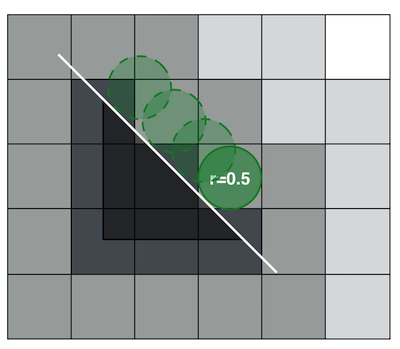{ width=50% }

因此需要优化SDF的计算，前面的SDF计算是栅格顶点到栅格阻挡的距离，阻挡区域本身是由多边形构成，那么实际角色移动应该是绕着多边形的边做直线移动，因此可采用点到多边形（polygon）的距离来计算栅格顶点的$\phi$值，在多边形内的点距离值为负，外面为正，得到如下图所示的SDF：

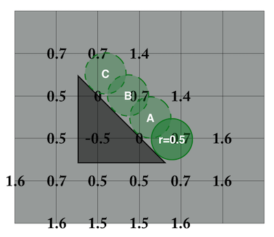{ width=50% }

通过双线性过滤方法可得角色半径 $r = 0.5$在ABC三处的$\phi$值均为$0.5$，因此角色在绕行障碍物时可以做到沿边平滑移动。

## 其他需求

### 如何将角色从障碍区域中移出

在MOBA类游戏有大量的击飞、击退等技能，角色难免会被击中“卡”在障碍区域中，对于这种情况需要能够快速的将角色移动最近的合适位置。因为梯度表示最大的变化方向，可用梯度快速查找合适位置：
$$
\mathbf{x}^\prime = \mathbf{x} + \nabla\phi(\mathbf{x})\left(r_\text{avatar}-\phi(\mathbf{x})\right)
$$
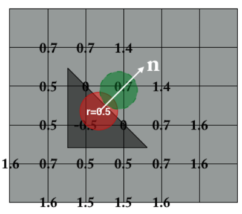{ width=50% }

如上图所示：$\mathbf{n}$为梯度方向，$r=0.5$为角色半径，红色圈位于障碍内，圆心$\phi=-0.1$，绿色圈为合法位置，圆心$\phi=0.6$，$0.6 = r - (-0.1)$。

当障碍是凸区域时一次迭代就能找到合适位置，非凸区域时一次迭代可能无法去到合适位置，而MOBA类地形大多是非凸区域，因此需要多次迭代，直到$\phi(\mathbf{x}^{\prime}) \geq r$时停止。

~~~cs
Vector2 newPos = pos;
for (int i = 0; i < 3; i++) {
    float SD = Sample(newPos);
    if (SD >= playerRadius)
        break;
    newPos += Gradient(newPos) * (playerRadius - SD);
}
~~~

### 角色不能越过障碍的远距离移动

当角色进行瞬时远距离移动，比如闪现，但又要求不能越过障碍（能越过障碍的情况则使用上面的方法），那么就需要进行连续碰撞检测用来规避穿越障碍的情况，使用圆盘投射（disk casting）进行规避，基于SDF的圆盘投射优势在于迭代步进可以使用当前的位置的$\phi$值，这大大降低了迭代次数。

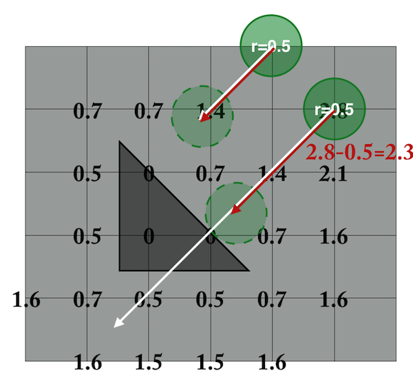{ width=50% }

~~~cs
//oriPos:原始位置，dir：冲刺方向，radius：角色半径，maxDist：最大冲刺距离
public Vector2 DiskCast(Vector2 origin, Vector2 dir, float radius, float maxDist) {
    float t = 0f;
    while (true) {
        Vector2 p = origin + dir * t;
        float sd = Sample(p);
        if (sd <= radius) return p;
        t += sd - radius;
        if (t >= maxDist) return origin + dir * maxDist;
    }
}
~~~

## 动态障碍物

以上均建立在预生成SDF的基础上，但在MOBA游戏中英雄技能带有阻挡效果是非常常见的，会在运行时生成动态障碍物。前面提到生成整张地图SDF的计算量大，根据动态障碍重新生成整个地图的SDF不现实。要解决动态障碍的情况，我们先来看下SDF的CSG运算规则：

- 交集  $\phi_{A\cup B}=\min(\phi_A,\phi_B)$
- 并集 $\phi_{A\cap B}=\max(\phi_A,\phi_B)$
- 补集 $\phi_{A\setminus B}=\phi_{A \cap B^C}=\max(\phi_A,-\phi_B)$ 

那么对于动态障碍物的情况，可以使用预生成的静态地图SDF和动态障碍SDF的叠加，即取二者的交集。同时动态障碍SDF可以直接用程序表示 @quilez2008modeling，比如常用的圆盘和矩形SDF：

​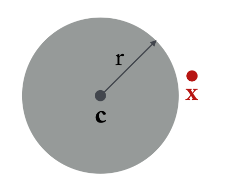{ width=50% }
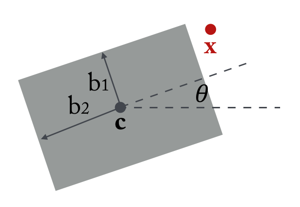{ width=50% }

圆盘SDF：
$$
\phi(\mathbf{x})=\|\mathbf{x}-\mathbf{c}\|-r
$$

~~~cs
//x 为任意点坐标，c为圆盘中心， r为圆盘半径
float sdCircle(Vector2 x, Vector2 c, float r) {
    return (x - c).Length() - r;
}
~~~

矩形SDF：
$$
\begin{aligned}
\mathbf{d} &= (\mathbf{x}-\mathbf{c})R(-\theta)-\mathbf{b}\\
\phi(\mathbf{x}) &= \min(\max(d_x, d_y), 0) + \|\max(\mathbf{d},\mathbf{0})\|
\end{aligned}
$$

~~~cs
// x 为任意点坐标， c为矩形中心， rot为矩形旋转角度，b为矩形边长
float sdBox(Vector2 x, Vector2 c, Vector2 rot, Vector2 b) {
    Vector2 p = Vector2.Dot(x - c, -rot);
    Vector2 d = Vector2.Abs(p) - b;
    return Mathf.Min(Mathf.Max(d.x, d.y), 0f) + Vector2.Max(d, Vector2.zero).Length();
}
~~~

盘为内部不可行走的动态阻挡，对于内部可以行走的环形阻挡则可视为外盘对内盘的**补集**。

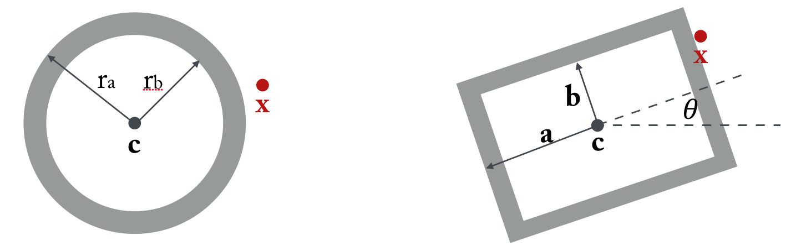{ width=50% }

对于部分英雄技能的打洞等跨越障碍的功能则可通过**补集**运算即可实现，非常容易。

至此通过SDF的运算规则很好的解决了动态障碍物的问题，但程序SDF的计算量相比静态SDF查表插值的运算量大，因此不适合具有大量动态障碍的情况。如果大量动态障碍分布稀疏，也可以通过空间分割管理动态障碍物，从而减少程序SDF的计算次数。

## AI寻路

MOBA类游戏小兵、野怪、陪玩角色AI都需要用到寻路，SDF亦能很好的处理这个问题。寻路算法可用经典的AStar或者JPS，通过修改探索函数，以SDF生成可行走的节点即可，判断探索节点的邻节点位置是否可以行走只需要判断其是否满足$\phi(\mathbf{x}) \geq r$。

对于可行走对象寻完路径之后行进过程中遇到动态障碍的情况，如果在已寻路径中按照摇杆移动方式从当前节点向下一个节点行走，则会自动绕障碍滑行，**无需重新寻路**。只要在遇到前面提到的凹形障碍中走不出来（即前后位置无变化）的情况下再进行一次寻路即可。

基于SDF的AStar寻路还能通过将$\phi$加入代价评估从而非常容易打破对称性，通过修改行走对象的半径$r$实现远离或者贴近障碍。

## 动态地图

使用预计算得到的SDF地图较难实现地图的动态更新，因为重新计算SDF比较耗时。那么我们如何能实现动态地图的需求呢？对于特殊游戏类型如地牢游戏（Rouge-like）中的地图本身就是由均匀网格所组成的，我们可以其为输入数据，将每一个网格都看作是一个矩形，可以用上文中提到的矩形SDF公式来表示单个矩形。

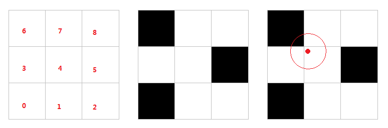{ width=100% }

在均匀网格地图上，当角色在一帧内行走的距离不会超过单个网格大小时，可以通过每帧去检测与玩家所在网格相邻的8个网格的碰撞来实现规避障碍物的功能。如上图，当玩家行走之后位于网格4时，图中最右边的红圈代表玩家，此时我们只需检测格子6、0、5与玩家的最近距离来进行碰撞规避。整个过程的伪代码如下：

~~~cs
float EvalSDF(Vector2 p) {
    int x = posToGridX(p);      //坐标离散成网格
    int y = posToGridY(p);
    float dist = cellSize;
    int center = grid[y * width + x];
    if (center == WALL)         //WALL格子不可行走
        dist = min(dist, sdBox(centerPos - vecTopLeft, cellExtents));
    int topleft = grid[(y - 1) * width + (x - 1)];
    if (topleft == WALL)
        dist = min(dist, sdBox(centerPos - vecTop, cellExtents));
    int top = grid[(y - 1) * width + x];
    // ...
    return dist;
}

Vector2 EvalGradient(Vector2 p) { /*... */ }

void Update() {
    Vector2 nextPlayerPos = playerPos + moveDir * moveSpeed; // 新目标位置
    float d = EvalSDF(nextPlayerPos); // 目标位置的最近距离
    if (d < playerRadius) { // 距离小于玩家半径，有穿插
        Vector2 n = EvalGradient(nextPlayerPos); // 计算最近表面的法线
        nextPlayerPos = nextPlayerPos + n * (playerRadius - d); // 将玩家推出障碍
    }
    playerPos = nextPlayerPos;
}
~~~

我们的SDF数据是通过读取网格地图中的可通过标记来决定这个格子是否参与计算，因此就可以实现可动态的修改均匀网格地图，可以在运行时标记某个格子的通过性。

可通过取距离场的梯度（Gradient）得到朝向向量，对于简单的几何图形可通过几何方法求出，比如圆形：

~~~c
Vector2 GradSphere(Vector2 p) {
    return p.Normalized();
}
~~~

对于矩形，假设坐标系原点在矩形中心，矩形的四个象限是相互镜像的，可将此问题退化为在一个象限内求解：

~~~cs
Vector2 GradBox(Vector2 p) {
    Vector2 d = Vector2.Abs(p) - halfSize; // 退化为在+x，+y象限求解
    Vector2 sign = Sign(p); // 记录符号，用来还原原始象限
    if (d.x > 0 && d.y > 0) // 假设以halfSize为中心，p落在右上区域，p-halfSize即为所求
        return (d * sign).Normalized();
    
    float max = Max(d.x, d.y); // 以halfSize为中心，检测距离x和y轴哪个更近
    Vector2 grad = new Vector2(max == d.x ? 1 : 0, max == d.y ? 1 : 0 ); // 距离x轴近，法线为y轴，反之相反
    return (grad * sign).Normalized();
}
~~~

刚才的方法是不考虑地图中会出现障碍物卡住玩家的情况的：

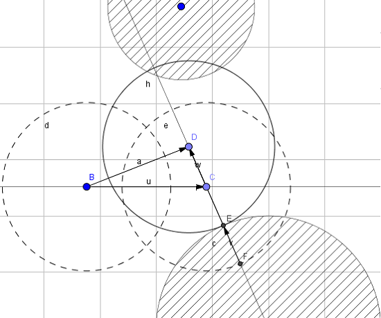{ width=50% }

要解决此问题，只需进行多次迭代求出最终修正的位置即可。而当玩家移动步幅较大时，如闪现等，需要进行连续碰撞检测，与基于预计算的离散SDF数据有所不同的是，均匀网格的SDF值都是以函数计算的高精度连续的值，因此计算方法与前文稍有不同：

~~~cs
bool DiskCast(Vector2 origin, Vector2 dir, float r, float maxDist, out float t) {
    t = 0;
    while (true) {
        // 根据当前t求出当前采样点p
        Vector2 p = origin + dir * t;
        float d = EvalSDF(p); // 采样出最近距离
        if (d < 0) // 若距离<0则p点在障碍里，结束迭代
            return false;
        
        if (d > radius + 0.001f) // 当距离与角色半径差距大于阀值时，继续迭代
            t += d - radius;
        else 
            return false; // 当距离与半径差距小于阀值，结束迭代
        
        if (t >= maxDist) { // 当t大于最大迭代距离，结束迭代
            t = maxDist;
            return true;
        }
    }
}
~~~

而场景中的其他障碍物如较大的汽车，其他玩家等则可通过矩形、圆形的SDF函数来表示，并将结果与网格地图取出的SDF做交集（union）操作。

## 总结

基于SDF的摇杆移动利用空间换时间，以较小的数据存储换来$O(1)$的碰撞检测效率，且能利用梯度高效率实现将角色从障碍物移动到可行走边界，做不越过障碍的瞬时远距离移动，通过SDF的CSG运算规则能很好的处理动态障碍问题，针对AI寻路能比较容易做到打破对称性、寻出远离或贴近障碍的路径。

当然SDF也有不足的地方即较难实现地形的动态变更，大量动态更新需要程序SDF从而导致增大运算量。但对于天然使用均匀网格地图的游戏来说，也可以实现运行时修改网格的可通过性，来实现地图的动态变更。

## 参考
