# Lua翻译工具-C#转Lua

adafdfadfadsfasdfasfasdfasdfas
asldflasdflasdfasldfasdlkfasd
fasdfasdfa


修改历史

| 修改日期   | 修改版本 | 修改描述 | 作者               |
| ---------- | -------- | -------- | ------------------ |
| 2018-09-29 | V1.0     | 初稿     | cheerluo,aikenchen |
|            |          |          |                    |

光子工作室群天玑智趣工作室 cheerluo

光子工作室群天玑智趣工作室 aikenchen
dddddd
szfdfasfdsfsd


luckywei luckywei

## 一、文档摘要

​	本文介绍一种C#代码转Lua代码的翻译方案，简称TKLua翻译方案。使用TKLua翻译方案，在项目开发时可以使用C#语言进行开发，而在项目发布时会将C#代码翻译成Lua代码。开发时兼顾C#的开发效率，发布后又享受Lua动态语言的便利，对于有代码热更新诉求的手机游戏来说，具有极其重要的意义。

​	TKLua翻译方案在行业内具有一定独特性，与传统翻译方案不同，TKLua翻译方案采用了翻译程序集DLL的形式，而并非翻译源代码。TKLua翻译方案利用编译器的编译完成了高级语言特性的分析，大幅降低了翻译难度，其翻译原理是：

​	**STEP 1 :** 利用Mono Cecil库分析DLL中的类、字段、方法签名，然后将其翻译成对应的Lua类型结构；

​	**STEP 2 :** 通过ILSpy工具分析IL指令集，生成由语句表达式组成的抽象结构树，并翻译成对应的Lua方法体；

​	**STEP 3 :** 把Lua类型结构与Lua方法体合并成完整的Lua代码文；

​	同样原理，还可以把C#代码翻译成其它语言，例如JavaScript，以快速移植到微信小游戏等平台，从而实现同一份代码翻译到多个语言平台，避免了重复开发工作。

​	利用TKLua翻译原理已经实现了一个独立的翻译工具，在使用上并没有限制，由于IL指令集比较固定有限，所以对C#语法支持已经比较完善，目前仅存极少C#语法暂未支持(例如内存、指针、锁等)，本文将详细介绍TKLua翻译方案的实现原理及应用场景。

## 二、设计初衷

​	手机游戏对代码热更新有很强的诉求，采用Lua开发是实现代码热更新的一个重要方案。

​	但是在实际的热更新项目中，往往需要开发团队熟练掌握Lua，才能输出高质量的Lua代码。经常听到开发者这样抱怨：Lua开发环境在编码提示不足导致开发效率偏低；Lua重构几乎不可能，程序员宁愿重写也不愿意重构；Lua缺少编译错误提示，所有错误运行时才报错等。诸多不便，究其原因大多是因Lua是弱类型语言造成。

​	本文介绍的TKLua翻译，是一种极低成本的翻译方案，它的设计初衷是让开发过程对Lua无感知，开发时使用C#开发，运行和发布时，一键把C#代码翻译成Lua。程序员既能享受C#的强类型、类型推导、类型检查带来的便利性，又能享受翻译后Lua动态语言热更新的优点。

​	通过翻译工具，还可以把没有C#源码的代码库翻译成对应的Lua代码库，避免了Lua的重复的开发工作。

## 三、实现原理

### 1. 翻译方案选型

​	为了设计一个合理的翻译方案，我们团队研究了行业内类似的解决方案：

* GWT：全称是Google Web Toolkit，该工具能把Java语言翻译成JavaScript，降低前端项目开发和维护难度。
* Bridge.NET：这是一个开源项目，它能够把C#语言翻译成JavaScript。

* CoffeeScript：这是一个把自定义的类似ruby的语言翻译成JavaScript。

​	以上解决方案，都是对原生语言进行词法分析、语法分析、语义分析，整个翻译工作量浩大，往往需要一个翻译团队才能完成。而我们的目标是需要把C#语言翻译成更低级的Lua语言，所以翻译的难度比以上任何一种方案难度都大。

​	基于这样困境，TKLua采用了相对比较独特的翻译过程，针对程序集DLL进行翻译，而不是针对源代码进行翻译，因为翻译程序集DLL可以大幅降低翻译难度。

### 2. 翻译原理

​	本节介绍TKLua翻译原理，TKLua翻译方案采用了翻译程序集DLL的形式，而并非翻译源代码。TKLua翻译方案利用编译器的编译完成了高级语言特性的分析，大幅降低了翻译难度，其翻译原理是：

​	**STEP 1 :** 利用Mono Cecil库分析DLL中的类、字段、方法签名，然后将其翻译成对应的Lua类型结构；

​	**STEP 2 :** 通过ILSpy工具分析IL指令集，生成由语句表达式组成的抽象结构树，并翻译成对应的Lua方法体；

​	**STEP 3 :** 把Lua类型结构与Lua方法体合并成完整的Lua代码文件；

TKLua结构图如下：

<center>
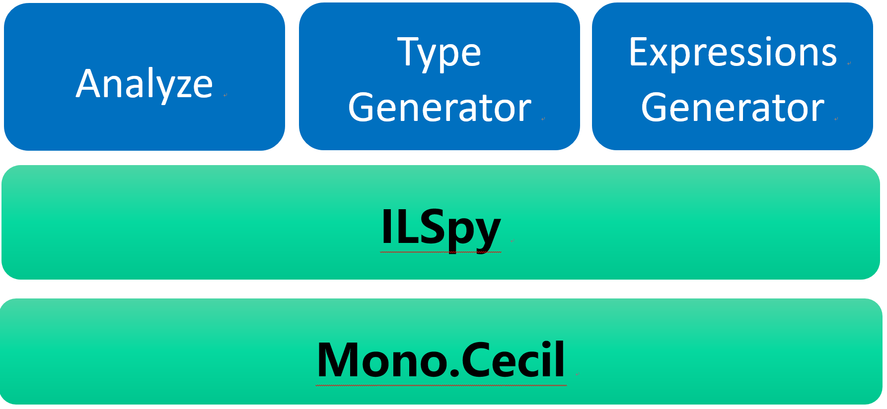
</center>

### 3. 翻译流程

​	本节详细介绍翻译流程，TKLua翻译流程，并没有去分析C#源代码，而是分析程序集DLL。在C#源代码经过编译得到DLL程序集之后，流程上经过三步对程序集DLL进行分析和生成：

​	**STEP 1 :** 类型结构翻译，通过Mono Cecil分析DLL中的包含的所有类，以及类中定义的字段和方法定义，收集到这些信息，于是可以生成Lua的对应的类型和结构及方法定义。注意的是，此时所得到的方法定义只包含方法签名，无法得到方法体；

​	**STEP 2 :** 方法体翻译，利用ILSpy将方法体里面的IL指令转换成抽象语法数(AST)结构，翻译工具将AST转换成Lua语句和表达式，形成Lua方法体；

​	**STEP 3 :** 把第一步输出的Lua类型结构与第二步输出的Lua方法体，合成完整的Lua文件，从而实现了C#到Lua的翻译过程；

翻译的流程图如下：

<center>
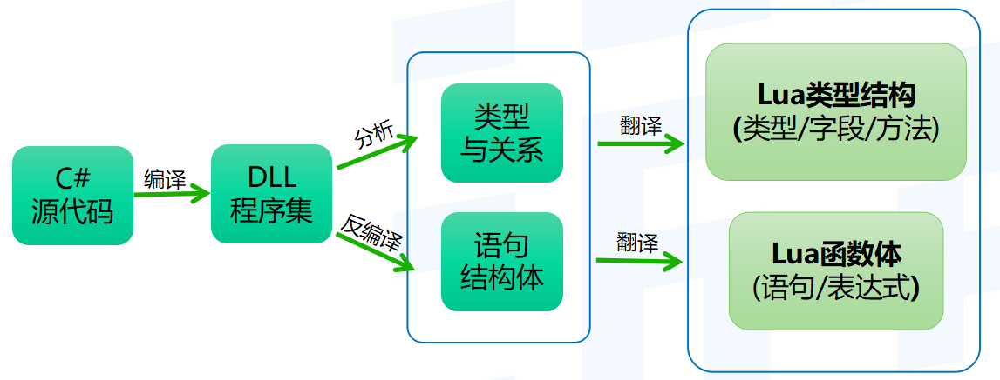
</center>

#### a.  类型结构翻译

​	本节详细介绍第一步类型结构翻译，如下图所示：

​	**STEP 1 :** 图最左边是C#源代码，定义了一个类Demo，包含x，y两个成员变量，以及一个成员函数Foo；

​	**STEP 2 :** 源代码经过编译之后，通过Mono Cecil分析DLL得到图中间的Cecil结构，结构内包含了Demo类型、x，y字段和方法Foo定义；

​	**STEP 3 :** 通过对Cecil结构的翻译，生成图最右边的Lua的Demo类型和Foo方法定义的输出，值得注意的是，此刻方法还只是方法签名，没有方法体。由于Lua是弱类型，x，y字段亦可无需定义；

<center>
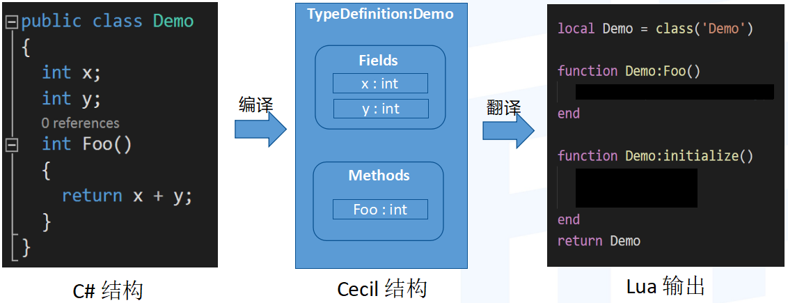
</center>

​	类型结构翻译，是通过Mono Cecil分析DLL中的包含的所有类，以及类中定义的字段和方法定义，生成Lua的对应的类型和结构及方法定义。

#### b. 方法体翻译

​	本节详细介绍第二步方法体翻译，如下图所示：

​	**STEP 1 :** 图最左边是C#源代码，定义了```int x=32; int y=18; return x+y;```三条语句。；

​	**STEP 2 :** 源代码经过编译之后，形成图中部的IL指令集，IL是基于栈的指令，图中含义是把值32存储在0号栈空间，值18存储在1号栈空间，然后执行add指令，并返回运算结果；

​	**STEP 3 :** 通过ILSpy分析上述IL指令流，生成ILSpy对应的抽象结构树AST，得到一个可读性非常强的结构体；

​	**STEP 4 :** 最后分析抽象结构树AST，并查找对应的符号表，最后翻译生成Lua对应的语句```local x=32; local y=18; return x+y```；

<center>
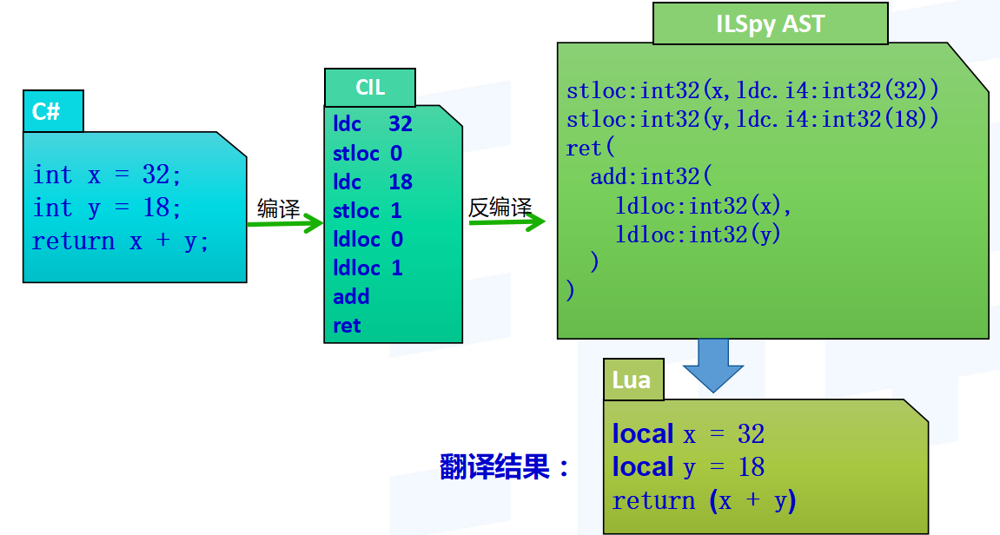
</center>

​	语句翻译过程，是通过ILSpy分析DLL中IL指令集，分析语句和表达式，生成Lua的语句和表达式，形成方法体。

​	最后把Lua类型结构和Lua方法体，合成完整的Lua文件，从而实现了C#到Lua的翻译过程。

## 四、翻译示例

本节详细介绍TKLua翻译示例，下图左侧是C#源代码，经过上述翻译过程之后得到下图右侧Lua源代码。可以看到，左边的C#代码与右边Lua代码基本能找到一一对应关系：

* C#中调用基类函数```base.Awake()```，翻译之后变成Lua中```Awake(self)```。
* 泛型函数```binding<...>()```，翻译之后泛型参数变成方法参数```binding(...)```。
* C#迭代器，翻译之后对应Lua迭代器。
* ```override```、虚函数。
* 多次调用```seats.Add```，翻译之后变成缓冲函数```F_Add```。
* C#风格注释，翻译之后对应Lua风格注释。

<center>
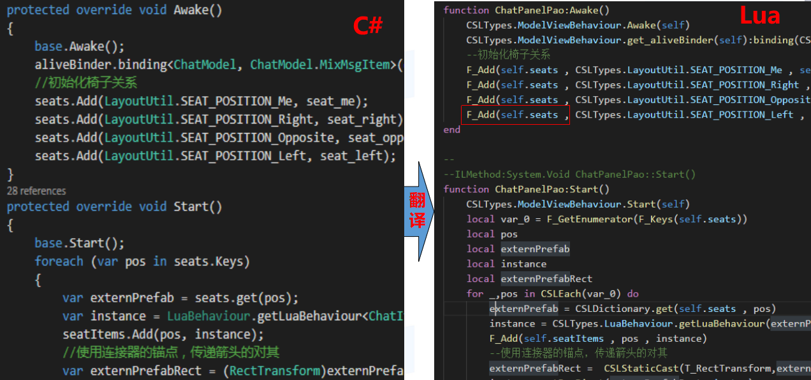
</center>

​	注意：由于在Lua中点运算其实就是一次Hash查找，而不是像编译型语言一样会分配固定的地址，所以有一定的消耗(特别是多级点运算)，一般有优化经验的人在编写Lua代码时会将不变化的函数缓存到upvalue。所以此处我们也做了类似自动的优化，生成了对应upvalue。

## 五、细节与优化

​	本节详细介绍翻译过程中一些注意细节及优化方法，例如Lua不支持连续赋值的问题、Lua不支持switch、Lua不支持continue等问题的解决方案。

### 1. Lua不支持连续赋值

​	在Lua中赋值是没有返回值，故无法对变量进行连续赋值，TKLua采用的方案是拆解表达式，如下图，把```y=x=foo()```拆解成两次独立赋值，利用临时变量csl_0作为中间存储：```csl_0=foo(); x=csl_0; y=csl_0;```

<center>
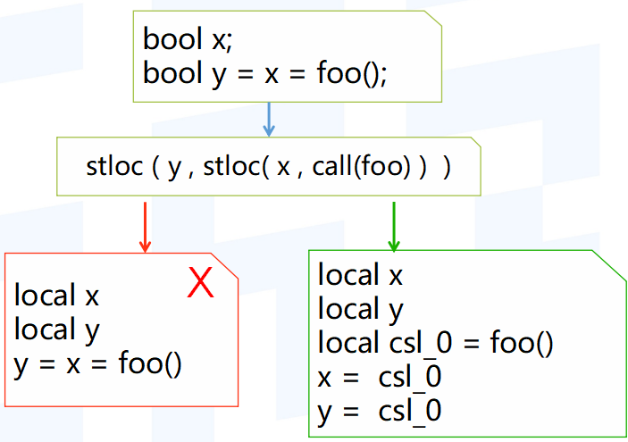
</center>

​	注意，如果采用闭包来模拟实现连续赋值，运行性能将会变差。

### 2. Lua不支持switch

​	由于在Lua中，没有switch语句，所以翻译过程中，需要用其它语句来模拟。TKLua翻译采用的是用if条件判定和repeat循环来模拟switch：

* switch中```case```判定，用```if...else...```模拟判定。
* switch中```break```跳转，用```repeat...break```模拟跳转。

编写的C#代码如下：

```c#
switch(v)
{
    case 1:
        <逻辑代码>
        break;
    case 2:
        <逻辑代码>
        break;
    default:
        <逻辑代码>
        break;
}
```

生成的Lua代码如下：

```lua
repeat
    if v==1 then 
        --case 1:
        --[逻辑代码]
        break;
    end
    	--case 2:
    	--[逻辑代码]
    	break;
    end
	--default:
	--[逻辑代码]
until true
```

​	注意，在Lua中if条件判定和repeat循环分别只需要一条指令，故性能不受影响。如果采用table表来模拟switch的功能，需要特别注意表的创建和销毁开销，避免运行性能变差。

### 3. Lua不支持continue

​	由于在Lua中，没有```continue```语句，所以翻译过程中，需要用其它语句来模拟。在一个循环块中可能同时存在任意数量的```continue```和```break```，如下图，TKLua翻译采用的是用内嵌```repeat```循环和```break```模拟：

* 增加内嵌```repeat```循环层。

* 原C#中一个```continue```，翻译成Lua中一个```break```，仅跳出内层循环。

* 原C#中一个```break```，翻译成Lua中两个```break```，跳出两层循环。

<center>
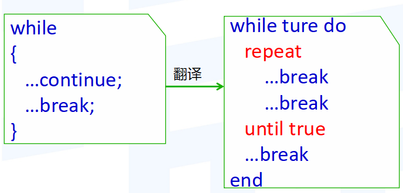
</center>

## 六、行业形势

​	TKLua翻译原理是针对程序集DLL进行翻译，而不是针对源代码翻译。而程序集DLL是经过编译器编译以及充分优化的，也就是利用编译器帮助我们实现了非常多的C#高级特性，所以大幅降低了翻译难度，这就是TKLua翻译在行业中的优势所在。

​	因为利用编译器的优化工作，所以让TKLua非常容易覆盖各种C#高级特性，翻译成本也大幅降低。

​	例如C#中Lambda表达式本身变化多样，如果按传统方式对Lambda源代码进行翻译的话，翻译难度非常大，甚至很多高级特性很难在Lua中真正模拟实现。而编译器的能力非常强大，在对源代码经过编译之后，Lambda表达式会被编译器展开成具体函数调用过程，这时再针对DLL进行翻译就无需任何工作量了。所以说对比传统翻译模式，TKLua翻译有较明显的优势。

​	TKLua翻译已支持和暂不支持的高级特性如下：

### 1. 已支持的高级特性

* 类、继承、方法、字段、协程、泛型函数
* 委托、枚举
* partial 、Indexer、属性、特性 
* Lambda、匿名类/匿名函数、操作符重载
* 预处理#IF、编译优化、混淆…

### 2. 暂不支持的特性

* 指针与内存
* async / wait / lock
* checked /  unchecked

​	在上述已支持的高级特性中，很多都是充分利用C#编译器的工作，减少了处理高级特性的复杂度。

除此之外，编译器还给TKLua翻译带来了一些优化的效果。

**性能优化：** 因为源代码在进行编译之后，将会对字符串、常量、枚举、计算等进行一系列优化，比如删除无效无用代码，预处理各种字符串，减少运行时开销等，这种优化也对最终Lua代码的生成产生优化效果。可以理解为，TKLua的翻译代码是经过编译优化之后的代码，对性能效率的提升非常有帮助。

**安全性：** 如果需要提高代码安全性，可以对DLL进行代码混淆，从而翻译后Lua代码也是混淆的，快速提高了代码安全性。

如下图，在对DLL混淆后，自动输出混淆后的Lua代码：

<center>
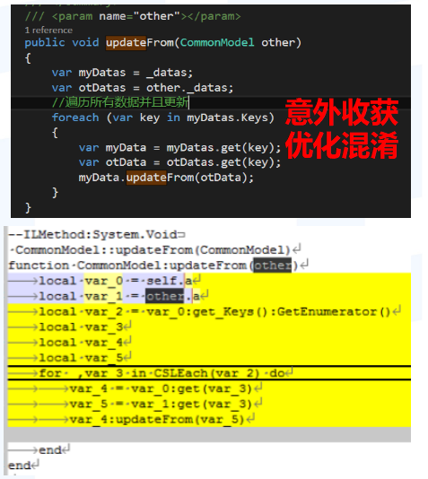
</center>

### 3. TKLua翻译蓝图

​	本节介绍的TKLua已经实现的翻译蓝图，是为了保障翻译完备性，列举了C#的各种高级特性。翻译蓝图一共分为三大部分内容：

**1)**     **类关系**

* partial类：编译后，自动合并完整的具体类，由编译器完成工作。
* 匿名类：编译后，生成具体实名类，由编译器完成工作。
* 嵌套类：生成Lua形式的嵌套关系，由翻译工具完成工作。
* 继承类：生成继承关系的类型，由翻译工具完成工作。
* 泛型类：暂无实现，后续可补充实现。

**2)**     **类成员**

* 字段初始化：编译后，在初始化函数中生成赋值过程，由编译器完成工作。
* 属性：编译后，添加set/get具体函数，由编译器完成工作。
* 索引器：编译后，索引对应的函数过程，由编译器完成工作。
* 扩展方法：编译后，为类扩展的方法变成静态函数调用，由编译器完成工作。
* 运算符重载：编译后，运算符重载变成具体函数调用，由编译器完成工作。
* 匿名函数：编译后，匿名函数自动变成实名函数，由编译器完成工作。
* 字段：弱类型语言字段，无需特别定义，由翻译工具完成工作。
* 方法：生成对应的常规Lua方法，由翻译工具完成工作。
* 构造函数：生成对应的Lua初始化函数，由翻译工具完成工作。
* 静态方法：生成对应的Lua对应的全局函数，由翻译工具完成工作。
* 泛型函数：泛型参数变成函数参数，生成对应Lua函数，由翻译工具完成工作。
* 匿名构造函数和类成员初始化：编译器将自动合并到构造函数里，翻译器输出。
* 匿名静态构造函数和静态成员初始化：编译器将自动生成语句，翻译器输出。
* 可选参数：编译后，未填写的参数将自动使用默认值填充，由编译器完成工作。
* 多参数：编译后等价于数组参数，由编译器完成工作。

**3)**     **函数体**

* Lambda表达式：编译后，表达式展开为具体函数调用，由编译器完成工作。
* 常量：编译后，常量名被替换为具体常量值，由编译器完成工作。
* 枚举：编译后，枚举值被替换为整形，由编译器完成工作。
* 引用关系：编译后，引用关系变成类型之间相互调用，由编译器完成工作。
* Typeof：编译后，替换成具体类型，由编译器完成工作。
* 泛型构造：编译后，泛型参数被实例化，由编译器完成工作。
* 赋值：生成Lua赋值，连续赋值将被拆解，由翻译工具完成工作。
* 局部变量：生成Lua的局部变量local，由翻译工具完成工作。
* 循环语句：反编译后所有的循环都变成单一的Loop结构，翻译器生成Lua的for循环。
* 条件语句：生成Lua的if条件，由翻译工具完成工作。
* switch语句：由if条件判定和repeat循环组合模拟，由翻译工具完成工作。
* 集合初始化(Collection initializer)：编译器生成结构化指令，由翻译器完成工作。
* 对象初始化(Object initializer)：编译器生成结构化指令，由翻译器完成工作。
* Try...catch语句：生成Lua的xpcall，由翻译工具完成工作。
* 问号表达式:生成等价的 ”或与表达式”。
* 其他：基本直接翻译，由翻译工具完成工作。

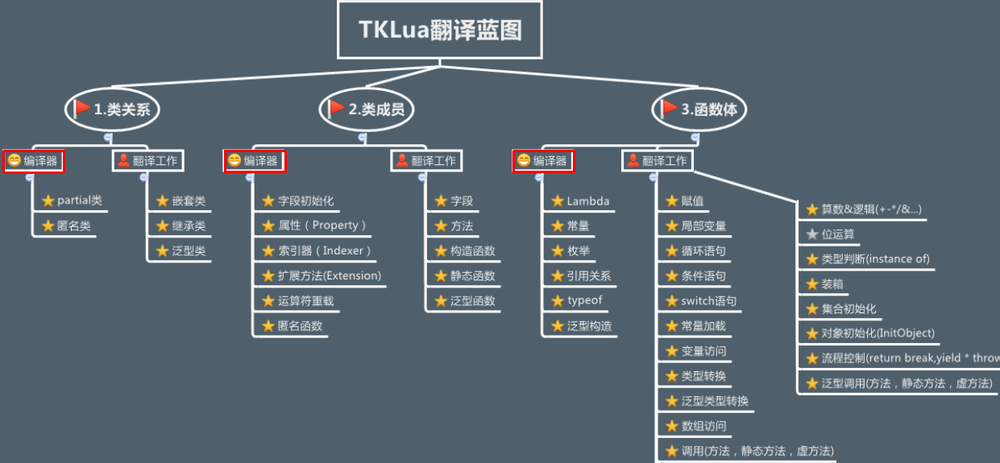

​	注意：上图红框列举高级特性的翻译，由编译器编译完成，大幅降低了翻译复杂度。

## 七、应用场景

### 1. 《麻将来了》热更新-应用场景

​	《麻将来了》是采用了TKLua的翻译模式的第一个项目，开发时使用C#开发，运行和发布时，一键把C#代码翻译成Lua。麻将的地方玩法众多，从市到县城，地方玩法的数量初步计划实现800种。在麻将来了项目中，登录、大厅、核心牌局、组局、商城、角色、道具、活动模块、好友系统、邮件系统、聊天等所有业务模块都是从C#翻译成Lua的，共计翻译50W行C#代码到Lua代码。


### 2. 《麻将来了》性能测试报告

在WeTest上对《麻将来了》做了性能测试，性能和耗电指标比较健康。

<center>
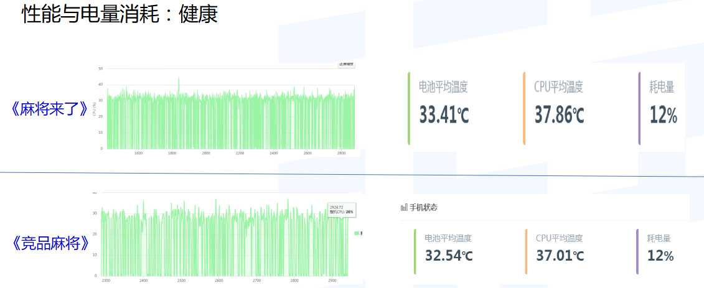
</center>

《麻将来了》内存比较平稳。

<center>
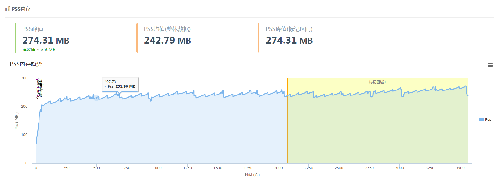
</center>

《麻将来了》crash率比较低。

<center>
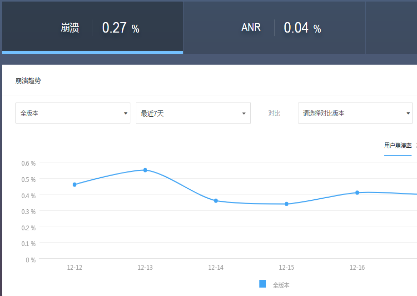
</center>

## 八、发展方向

​	随着微信小游戏的兴起，越来越多的游戏团队开始关注h5游戏的开发，如果游戏团队想把原有的游戏移植到h5游戏平台，面临着游戏功能需要用Js重写一遍，工程量比较浩大。但如果用翻译呢？翻译可以大幅降低重复开发成本。

​	上述章节详尽介绍了如何把C#代码翻译成Lua代码，那么利用相同的原理，也能把C#代码翻译成Js代码，如下图，左侧是TKLua把C#代码一键翻译成Lua代码，右侧是把C#代码一键翻译成Js代码。

​	基于这样的思路方案，TKLua翻译工具增加实现了从C#转Js的翻译功能，为游戏快速移植到微信小游戏平台提供了一种便捷方案。

<center>
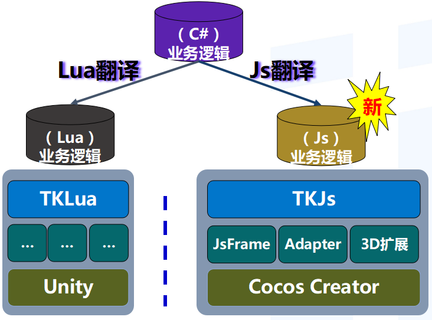
</center>

如下图示：C#翻译到Js的效果

<center>
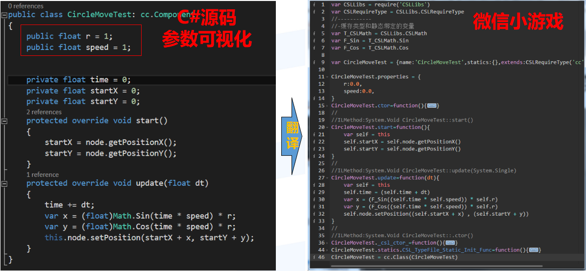
</center>

​	如果各游戏已经有Unity C#版本，通过上述的翻译过程，就可以快速得到微信小游戏版本、手Q玩一玩、Facebook Instant Games，这样翻译将为部门为公司节省大量开发工作量，以及维护成本。
